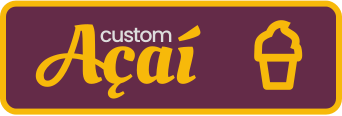

<h2 align="center"> - Custom Açaí -</h2>

<a href="https://custom-acai.netlify.app/" target="_blank">👉 Acesse a página aqui 👈</a>

## - Projeto Custom Açaí - 
 
Sem dúvidas o melhor projeto do portifólio!! Se trata de uma página de uma açaitería que simula um ecommerce, que além de podermos adicionar os açaís do cardápio no carrinho, podemos criar os nossos próprios e vê-los como fica em tempo real! Legal né?
 
 
<!--  -->

## - Funcionalidades -
 

◽ Customizar passo a passo açaí

◽ Adicionar açaí customizado no carrinho

◽ Adicionar açaís do cardápio no carrinho

◽ Visualizar detalhes dos acaís padrões

◽ Visualizar acaís do carrinho

◽ Manipular quantidade de açaís no carrinho

◽ Finalizar compras do carrinho

 

## - Tecnologias utilizadas -
 
<!-- HTML -->
<!-- REACT -->
 

<!-- CSS -->

 
 
 

 

## - Meus contatos -
 

Sinta-se livre para entrar em contato comigo, seja para dar algum feedback do projeto, pedir alguma ajuda ou também apenas conversar um pouco sobre desenvolvimento e tecnologias =D

 

 
  <a href = "mailto:gabrecrisanto@gmail.com" target="_blank">
  
   
   
   
  
